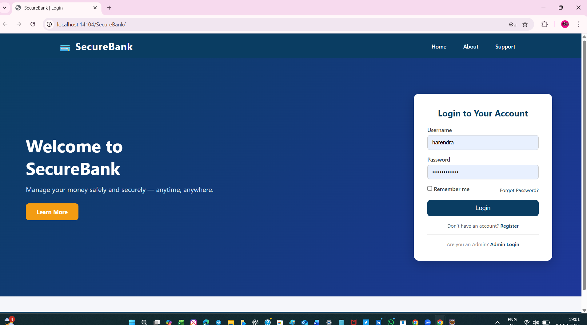
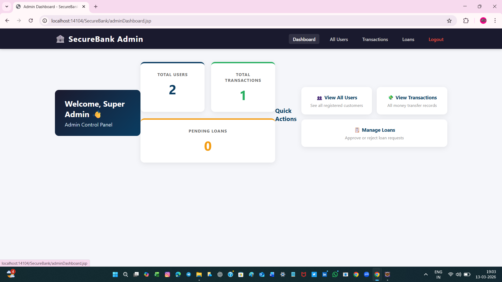
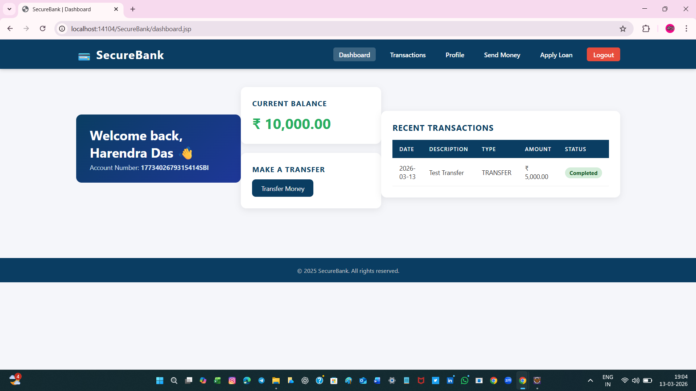

# 💳 SecureBank - Banking Management System

A full stack **Banking Management System** built with Java, JSP, Servlets, JDBC and Oracle Database.

---

## 🚀 Features
- ✅ User Registration, Login, Logout
- ✅ Dashboard with real time balance
- ✅ Send Money & Transaction History
- ✅ Apply for Loans (Home, Personal, Education, Vehicle, Business)
- ✅ Admin Panel — Approve/Reject Loans, View Users & Transactions
- ✅ MD5 Password Hashing & Input Validation

---

## 🛠️ Tech Stack
`Java` `JSP` `Servlets` `JDBC` `Oracle XE` `Apache Tomcat 9` `HTML/CSS` `Eclipse IDE`

---

## ⚙️ How to Run
1. Clone → `git clone https://github.com/HarendraDas/SecureBank.git`
2. Run SQL files in Oracle SQL Developer
3. Update DB credentials in `DBConnection.java`
4. Deploy on Tomcat 9 in Eclipse
5. Open → `http://localhost:8080/BankApplication/`

---

## 👤 Admin Credentials
| Field | Value |
|---|---|
| Username | `admin` |
| Password | `admin123` |

---

## 📸 Screenshots

### 🔐 Login Page

### 🏠 User Dashboard

### ⚙️ Admin Panel

---

## 👨‍💻 Developer
**Harendra Das** · harendradas2003@gmail.com · Hyderabad, India
